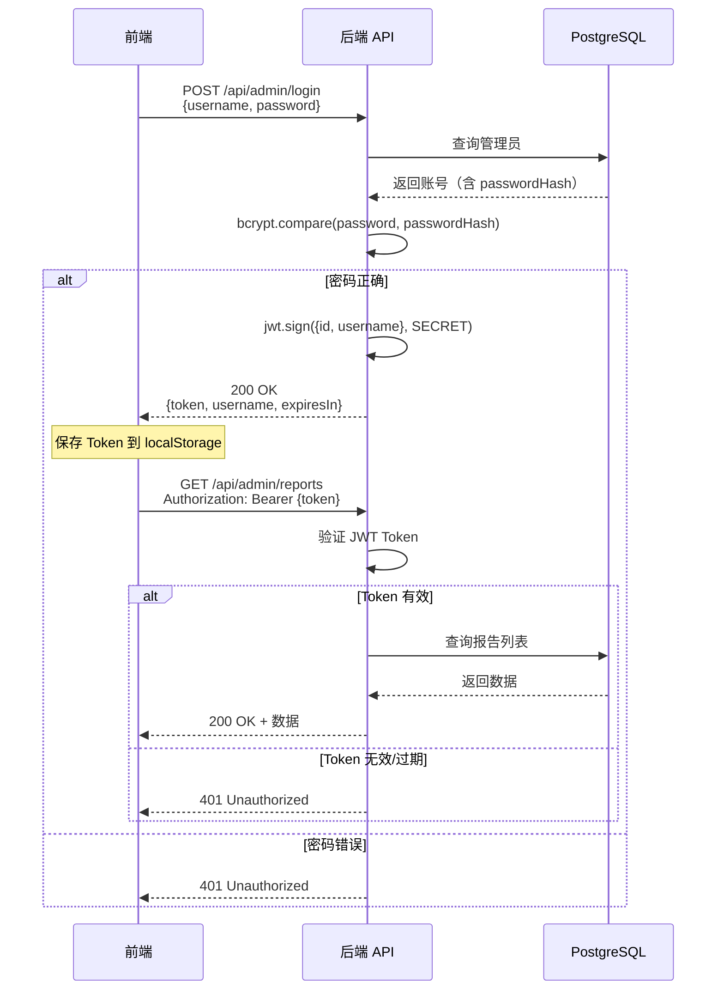

# Backend Architecture

## Service Architecture

### Controller/Route Organization

```
apps/api/src/
├── routes/                  # 路由定义
│   ├── index.ts             # 主路由聚合
│   ├── publicRoutes.ts      # 公开路由
│   └── adminRoutes.ts       # 管理员路由
├── controllers/             # 控制器
│   ├── reportController.ts  # 报告控制器
│   ├── adminController.ts   # 管理员控制器
│   └── uploadController.ts  # 文件上传控制器
├── services/                # 业务逻辑
│   ├── reportService.ts     # 报告服务
│   ├── adminService.ts      # 管理员服务
│   └── fileService.ts       # 文件服务
├── repositories/            # 数据访问
│   ├── reportRepository.ts  # 报告仓储
│   └── adminRepository.ts   # 管理员仓储
├── middleware/              # 中间件
│   ├── auth.ts              # JWT 认证中间件
│   ├── errorHandler.ts      # 错误处理中间件
│   └── validate.ts          # 输入验证中间件
├── utils/                   # 工具函数
│   ├── jwt.ts               # JWT 工具
│   ├── logger.ts            # 日志工具
│   └── config.ts            # 配置管理
├── types/                   # 类型定义
├── prisma/                  # Prisma 配置
│   └── schema.prisma        # 数据库模型
└── server.ts                # 服务器入口
```

### Controller Template

```typescript
// apps/api/src/controllers/reportController.ts
import { Request, Response, NextFunction } from 'express';
import { reportService } from '../services/reportService';
import { CreateReportDto, UpdateReportDto } from '@checkReport/shared';

export const reportController = {
  // 公开查询报告
  async getByReportNumber(req: Request, res: Response, next: NextFunction) {
    try {
      const { reportNumber } = req.params;
      const report = await reportService.findByReportNumber(reportNumber);

      if (!report) {
        return res.status(404).json({
          error: '未找到该报告，请确认报告编号是否正确',
        });
      }

      res.json(report);
    } catch (error) {
      next(error);
    }
  },

  // 获取报告列表（管理员）
  async getList(req: Request, res: Response, next: NextFunction) {
    try {
      const { page = 1, limit = 20, search } = req.query;
      const result = await reportService.findAll({
        page: Number(page),
        limit: Number(limit),
        search: search as string,
      });

      res.json(result);
    } catch (error) {
      next(error);
    }
  },

  // 创建报告（管理员）
  async create(req: Request, res: Response, next: NextFunction) {
    try {
      const dto: CreateReportDto = req.body;
      const report = await reportService.create(dto);

      res.status(201).json(report);
    } catch (error) {
      // 处理唯一约束冲突
      if ((error as any).code === 'P2002') {
        return res.status(409).json({ error: '报告编号已存在' });
      }
      next(error);
    }
  },

  // 更新报告（管理员）
  async update(req: Request, res: Response, next: NextFunction) {
    try {
      const { id } = req.params;
      const dto: UpdateReportDto = req.body;

      const report = await reportService.update(Number(id), dto);
      if (!report) {
        return res.status(404).json({ error: '报告不存在' });
      }

      res.json(report);
    } catch (error) {
      next(error);
    }
  },

  // 删除报告（管理员）
  async delete(req: Request, res: Response, next: NextFunction) {
    try {
      const { id } = req.params;
      const deleted = await reportService.delete(Number(id));

      if (!deleted) {
        return res.status(404).json({ error: '报告不存在' });
      }

      res.json({ message: '报告删除成功' });
    } catch (error) {
      next(error);
    }
  },
};
```

---

## Database Architecture

### Schema Design

参考前面的 Prisma Schema Definition 部分。

### Data Access Layer

```typescript
// apps/api/src/repositories/reportRepository.ts
import { PrismaClient, Report, Prisma } from '@prisma/client';
import { CreateReportDto, UpdateReportDto } from '@checkReport/shared';

const prisma = new PrismaClient();

export const reportRepository = {
  async findByReportNumber(reportNumber: string): Promise<Report | null> {
    return prisma.report.findUnique({
      where: { reportNumber },
    });
  },

  async findAll(params: {
    skip: number;
    take: number;
    where?: Prisma.ReportWhereInput;
    orderBy?: Prisma.ReportOrderByWithRelationInput;
  }): Promise<{ reports: Report[]; total: number }> {
    const [reports, total] = await prisma.$transaction([
      prisma.report.findMany(params),
      prisma.report.count({ where: params.where }),
    ]);

    return { reports, total };
  },

  async create(data: CreateReportDto): Promise<Report> {
    return prisma.report.create({
      data: {
        reportNumber: data.reportNumber,
        reportType: data.reportType,
        inspectionDate: new Date(data.inspectionDate),
        equipmentName: data.equipmentName,
        clientCompany: data.clientCompany,
        userCompany: data.userCompany,
        fileUrl: data.fileUrl,
        fileType: data.fileType,
      },
    });
  },

  async update(id: number, data: UpdateReportDto): Promise<Report | null> {
    try {
      return await prisma.report.update({
        where: { id },
        data: {
          ...(data.reportType && { reportType: data.reportType }),
          ...(data.inspectionDate && { inspectionDate: new Date(data.inspectionDate) }),
          ...(data.equipmentName && { equipmentName: data.equipmentName }),
          ...(data.clientCompany && { clientCompany: data.clientCompany }),
          ...(data.userCompany && { userCompany: data.userCompany }),
        },
      });
    } catch (error) {
      if ((error as any).code === 'P2025') {
        return null; // 记录不存在
      }
      throw error;
    }
  },

  async delete(id: number): Promise<boolean> {
    try {
      await prisma.report.delete({ where: { id } });
      return true;
    } catch (error) {
      if ((error as any).code === 'P2025') {
        return false; // 记录不存在
      }
      throw error;
    }
  },

  async count(): Promise<number> {
    return prisma.report.count();
  },
};
```

---

## Authentication and Authorization

### Auth Flow



### Middleware/Guards

```typescript
// apps/api/src/middleware/auth.ts
import { Request, Response, NextFunction } from 'express';
import jwt from 'jsonwebtoken';
import { AdminPayload } from '@checkReport/shared';
import { config } from '../utils/config';

// 扩展 Request 类型，添加 user 属性
declare global {
  namespace Express {
    interface Request {
      user?: AdminPayload;
    }
  }
}

export const authMiddleware = (req: Request, res: Response, next: NextFunction) => {
  try {
    const authHeader = req.headers.authorization;

    if (!authHeader || !authHeader.startsWith('Bearer ')) {
      return res.status(401).json({ error: '未授权：缺少认证令牌' });
    }

    const token = authHeader.substring(7); // 移除 "Bearer " 前缀

    const payload = jwt.verify(token, config.jwtSecret) as AdminPayload;
    req.user = payload;

    next();
  } catch (error) {
    if (error instanceof jwt.JsonWebTokenError) {
      return res.status(401).json({ error: '未授权：令牌无效' });
    }
    if (error instanceof jwt.TokenExpiredError) {
      return res.status(401).json({ error: '未授权：令牌已过期' });
    }

    next(error);
  }
};
```

---
