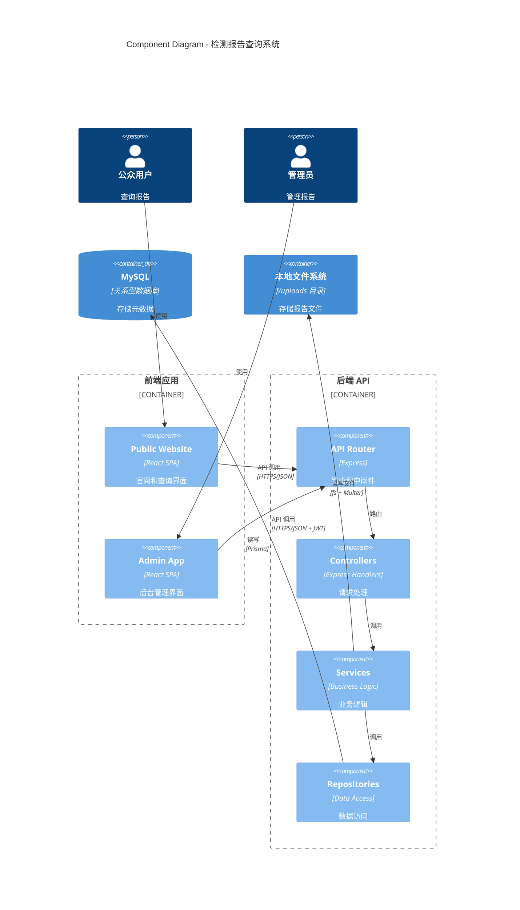

# Components

## Frontend Components

### 1. Public Website App

**Responsibility:** 面向公众的官网前台，提供公司简介和报告查询功能。

**Key Interfaces:**
- 首页路由：`/`
- 报告详情路由：`/reports/:reportNumber`

**Dependencies:**
- 后端 API：`GET /api/reports/:reportNumber`
- Nginx：加载静态资源和文件

**Technology Stack:**
- React 18 + TypeScript
- React Router for SPA 路由
- Ant Design 组件库
- TailwindCSS 自定义样式
- Axios 进行 API 调用

---

### 2. Admin Management App

**Responsibility:** 管理员后台，提供报告上传、编辑、删除和列表查看功能。

**Key Interfaces:**
- 登录路由：`/admin/login`
- 后台首页：`/admin`
- 报告列表：`/admin/reports`
- 上传报告：`/admin/upload`
- 编辑报告：`/admin/reports/:id/edit`

**Dependencies:**
- 后端 API：所有 `/api/admin/*` 接口
- JWT Token 存储：localStorage

**Technology Stack:**
- React 18 + TypeScript
- React Router + 受保护路由（AuthGuard）
- Ant Design 表格、表单组件
- Context API 管理认证状态

---

## Backend Components

### 3. API Gateway / Router Layer

**Responsibility:** 接收 HTTP 请求，路由到对应的 Controller，应用中间件（CORS、认证、错误处理）。

**Key Interfaces:**
- Express Router
- 中间件管道

**Dependencies:**
- Controller Layer

**Technology Stack:**
- Express.js
- cors 中间件
- helmet 安全中间件
- JWT 认证中间件

---

### 4. Controller Layer

**Responsibility:** 处理 HTTP 请求，验证输入，调用 Service Layer，返回 HTTP 响应。

**Key Interfaces:**
- `ReportController`: 处理报告相关请求
- `AdminController`: 处理管理员认证和管理请求
- `UploadController`: 处理文件上传

**Dependencies:**
- Service Layer

**Technology Stack:**
- Express Request/Response handlers
- express-validator 进行输入验证

---

### 5. Service Layer

**Responsibility:** 实现业务逻辑，协调多个 Repository，处理事务和复杂操作。

**Key Interfaces:**
- `ReportService`: 报告业务逻辑
- `AdminService`: 管理员业务逻辑
- `FileService`: 文件上传下载业务逻辑

**Dependencies:**
- Repository Layer
- Multer (文件上传中间件)
- fs (Node.js 文件系统模块)

**Technology Stack:**
- TypeScript 类
- bcrypt 密码加密
- jsonwebtoken JWT 生成和验证

---

### 6. Repository Layer

**Responsibility:** 封装数据库访问，提供统一的数据操作接口（CRUD）。

**Key Interfaces:**
- `ReportRepository`: 报告数据访问
- `AdminRepository`: 管理员数据访问

**Dependencies:**
- Prisma ORM
- PostgreSQL 数据库

**Technology Stack:**
- Prisma Client
- TypeScript 类

---

### 7. Database (PostgreSQL + Prisma)

**Responsibility:** 持久化存储报告和管理员数据，保证 ACID 事务。

**Key Interfaces:**
- Prisma Schema 定义
- 数据库迁移

**Dependencies:**
- 无（底层基础设施）

**Technology Stack:**
- PostgreSQL 15+
- Prisma ORM

---

### 8. File Storage (本地文件系统)

**Responsibility:** 存储报告文件（PDF、图片）到服务器本地目录。

**Key Interfaces:**
- Multer 中间件配置
- 文件路径生成和访问

**Dependencies:**
- 无（Node.js 原生模块）

**Technology Stack:**
- Multer (文件上传中间件)
- Node.js fs 模块
- 文件存储目录：`/var/www/checkReport/uploads` 或配置指定目录

---

## Component Diagrams

---
