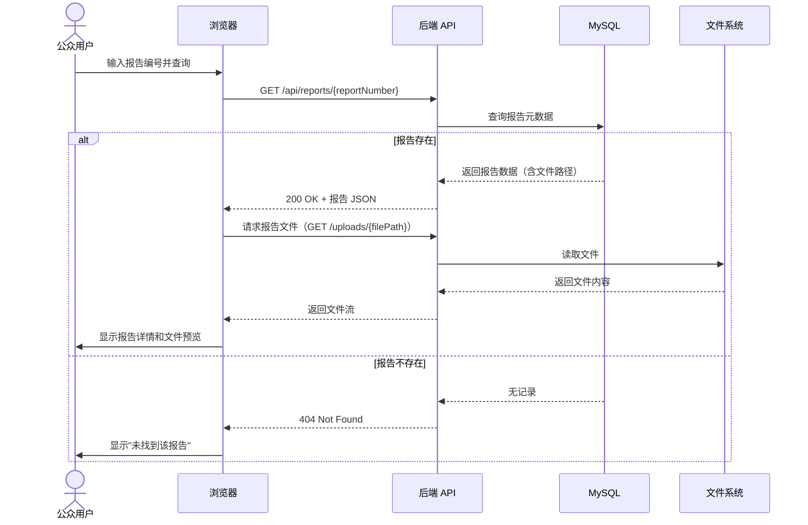
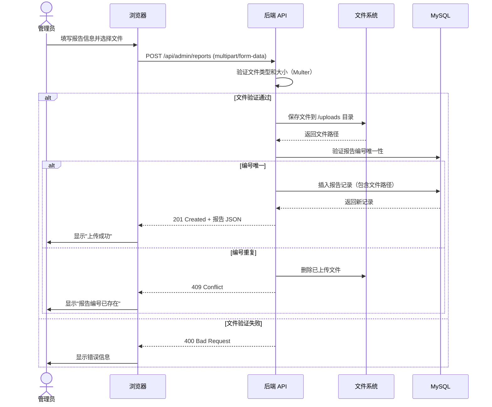
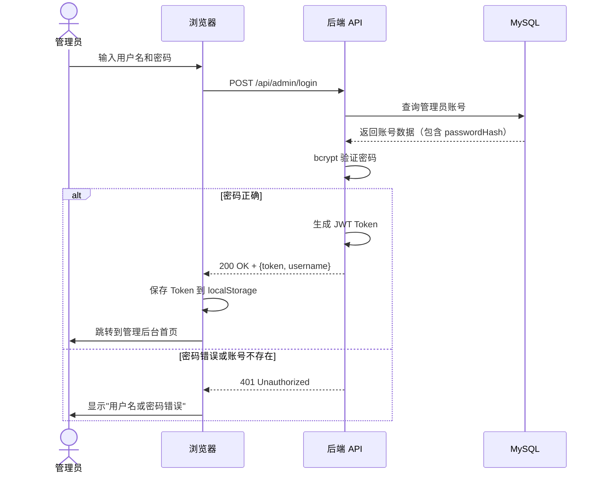

# Core Workflows

## 报告查询工作流

```mermaid
sequenceDiagram
    actor User as 公众用户
    participant Browser as 浏览器
    participant API as 后端 API
    participant DB as MySQL
    participant FileSystem as 文件系统

    User->>Browser: 输入报告编号并查询
    Browser->>API: GET /api/reports/{reportNumber}
    API->>DB: 查询报告元数据
    alt 报告存在
        DB-->>API: 返回报告数据（含文件路径）
        API-->>Browser: 200 OK + 报告 JSON
        Browser->>API: 请求报告文件（GET /uploads/{filePath}）
        API->>FileSystem: 读取文件
        FileSystem-->>API: 返回文件内容
        API-->>Browser: 返回文件流
        Browser->>User: 显示报告详情和文件预览
    else 报告不存在
        DB-->>API: 无记录
        API-->>Browser: 404 Not Found
        Browser->>User: 显示"未找到该报告"
    end
```

## 报告上传工作流

```mermaid
sequenceDiagram
    actor Admin as 管理员
    participant Browser as 浏览器
    participant API as 后端 API
    participant FileSystem as 文件系统
    participant DB as MySQL

    Admin->>Browser: 填写报告信息并选择文件
    Browser->>API: POST /api/admin/reports (multipart/form-data)

    API->>API: 验证文件类型和大小（Multer）
    alt 文件验证通过
        API->>FileSystem: 保存文件到 /uploads 目录
        FileSystem-->>API: 返回文件路径
        API->>DB: 验证报告编号唯一性
        alt 编号唯一
            API->>DB: 插入报告记录（包含文件路径）
            DB-->>API: 返回新记录
            API-->>Browser: 201 Created + 报告 JSON
            Browser->>Admin: 显示"上传成功"
        else 编号重复
            API->>FileSystem: 删除已上传文件
            API-->>Browser: 409 Conflict
            Browser->>Admin: 显示"报告编号已存在"
        end
    else 文件验证失败
        API-->>Browser: 400 Bad Request
        Browser->>Admin: 显示错误信息
    end
```

## 管理员登录工作流

```mermaid
sequenceDiagram
    actor Admin as 管理员
    participant Browser as 浏览器
    participant API as 后端 API
    participant DB as MySQL

    Admin->>Browser: 输入用户名和密码
    Browser->>API: POST /api/admin/login
    API->>DB: 查询管理员账号
    DB-->>API: 返回账号数据（包含 passwordHash）
    API->>API: bcrypt 验证密码
    alt 密码正确
        API->>API: 生成 JWT Token
        API-->>Browser: 200 OK + {token, username}
        Browser->>Browser: 保存 Token 到 localStorage
        Browser->>Admin: 跳转到管理后台首页
    else 密码错误或账号不存在
        API-->>Browser: 401 Unauthorized
        Browser->>Admin: 显示"用户名或密码错误"
    end
```

---
