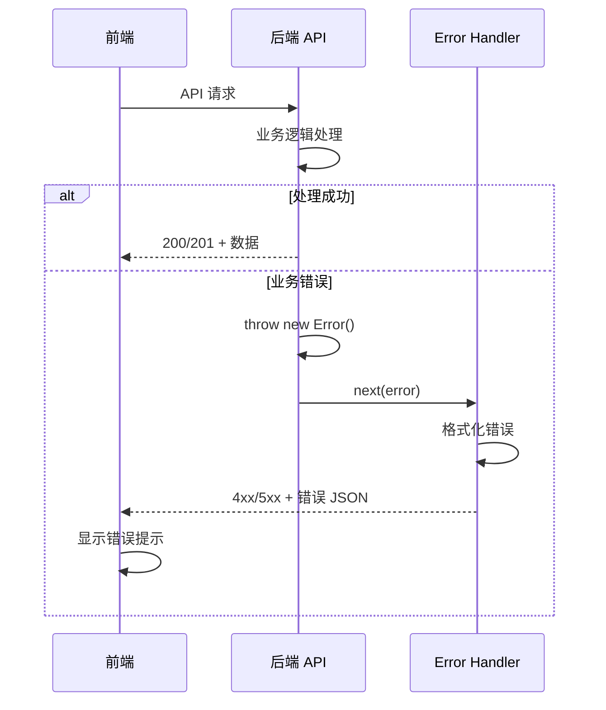

# Error Handling Strategy

## Error Flow



## Frontend Error Handling

```typescript
// apps/web/src/services/api.ts (响应拦截器部分)
apiClient.interceptors.response.use(
  (response) => response,
  (error: AxiosError) => {
    if (error.response) {
      const { status, data } = error.response;
      const errorMessage = (data as any)?.error || '请求失败';

      // 根据状态码显示不同的错误提示
      switch (status) {
        case 400:
          message.error(`请求错误：${errorMessage}`);
          break;
        case 401:
          message.error('登录已过期，请重新登录');
          // 清除认证信息并跳转登录页
          localStorage.removeItem('auth_token');
          window.location.href = '/admin/login';
          break;
        case 404:
          // 404 由页面组件处理，不全局提示
          break;
        case 409:
          message.error(`操作冲突：${errorMessage}`);
          break;
        case 500:
          message.error('服务器错误，请稍后重试');
          break;
        default:
          message.error(errorMessage);
      }
    } else if (error.request) {
      message.error('网络连接失败，请检查网络');
    }

    return Promise.reject(error);
  }
);
```

## Backend Error Handling

```typescript
// apps/api/src/middleware/errorHandler.ts
import { Request, Response, NextFunction } from 'express';
import { logger } from '../utils/logger';
import { v4 as uuidv4 } from 'uuid';

interface ApiError {
  error: {
    code: string;
    message: string;
    details?: Record<string, any>;
    timestamp: string;
    requestId: string;
  };
}

export const errorHandler = (
  err: Error,
  req: Request,
  res: Response,
  next: NextFunction
) => {
  const requestId = uuidv4();

  // 记录错误日志
  logger.error({
    requestId,
    method: req.method,
    url: req.url,
    error: err.message,
    stack: err.stack,
  });

  // 确定状态码
  let statusCode = 500;
  let errorCode = 'INTERNAL_SERVER_ERROR';
  let errorMessage = '服务器内部错误';

  // 处理已知错误类型
  if (err.name === 'ValidationError') {
    statusCode = 400;
    errorCode = 'VALIDATION_ERROR';
    errorMessage = err.message;
  } else if (err.name === 'UnauthorizedError') {
    statusCode = 401;
    errorCode = 'UNAUTHORIZED';
    errorMessage = '未授权访问';
  } else if (err.name === 'NotFoundError') {
    statusCode = 404;
    errorCode = 'NOT_FOUND';
    errorMessage = err.message;
  } else if ((err as any).code === 'P2002') {
    // Prisma 唯一约束冲突
    statusCode = 409;
    errorCode = 'DUPLICATE_ENTRY';
    errorMessage = '数据已存在';
  }

  // 构造标准错误响应
  const errorResponse: ApiError = {
    error: {
      code: errorCode,
      message: errorMessage,
      timestamp: new Date().toISOString(),
      requestId,
    },
  };

  // 开发环境返回详细错误信息
  if (process.env.NODE_ENV === 'development') {
    errorResponse.error.details = {
      originalMessage: err.message,
      stack: err.stack,
    };
  }

  res.status(statusCode).json(errorResponse);
};
```

---
