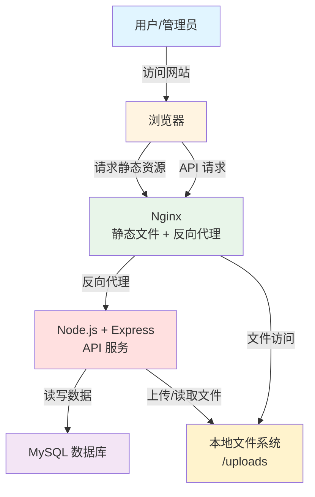

# High Level Architecture

## Technical Summary

本系统采用**单体架构**的全栈 Web 应用，前后端分离设计。前端使用 **React 18** 构建响应式 SPA，通过 **RESTful API** 与后端通信。后端基于 **Node.js (Express)** 提供 API 服务，使用 **MySQL** 存储结构化数据，报告文件直接存储在**服务器本地文件系统**（上传目录）。管理后台采用 **JWT Token** 认证，确保安全性。系统可部署在任意 Linux 服务器上，前端使用 Nginx 托管静态文件，后端使用 PM2 管理 Node.js 进程。这种架构简单直接，开发和维护成本低，非常适合小型团队快速交付 MVP，未来可根据需求扩展至云存储方案。

## Platform and Infrastructure Choice

**平台选择：独立服务器部署**

**选择理由：**
1. **成本优势：** MVP 阶段无需云存储服务费用，降低初期成本
2. **简单直接：** 本地文件系统存储，无需额外配置 OSS SDK
3. **易于开发：** 开发环境和生产环境配置一致，简化部署流程
4. **灵活扩展：** 未来可根据需求迁移到云存储服务（阿里云 OSS 或腾讯云 COS）

**核心服务：**
- **Linux 服务器：** 部署后端 Node.js 应用（推荐 Ubuntu 20.04+）
- **MySQL 数据库：** 本地或远程 MySQL 实例
- **Nginx：** 反向代理 + 静态文件服务器
- **PM2：** Node.js 进程管理和自动重启
- **文件存储：** 服务器本地目录（如 `/var/www/checkReport/uploads`）

**部署区域：** 根据实际服务器位置，建议靠近目标用户群体（浙江省）

---

## Repository Structure

**结构：Monorepo**

**Monorepo 工具：pnpm workspaces**

**选择理由：**
1. **团队规模小：** 1-2 名开发者，Monorepo 简化依赖管理和代码共享
2. **类型共享：** 前后端共享 TypeScript 类型定义，减少重复
3. **统一构建：** 一次性运行所有测试和构建任务
4. **版本管理：** 前后端版本同步，避免兼容性问题

**包组织策略：**
```
checkReport/                    # 项目根目录
├── apps/                       # 应用层
│   ├── web/                    # 前端应用
│   └── api/                    # 后端应用
├── packages/                   # 共享包
│   ├── shared/                 # 共享类型和工具
│   └── config/                 # 共享配置
```

---

## High Level Architecture Diagram



---

## Architectural Patterns

- **前后端分离（SPA + API）：** 前端 React SPA 通过 RESTful API 与后端通信，实现清晰的职责分离。_Rationale:_ 提高开发效率，前后端可独立开发和部署，便于未来扩展移动端或小程序。

- **分层架构（Layered Architecture）：** 后端采用 Controller-Service-Repository 三层结构，分离路由处理、业务逻辑和数据访问。_Rationale:_ 提高代码可维护性和可测试性，便于单元测试和集成测试。

- **Repository 模式：** 封装数据库访问逻辑，提供统一的数据操作接口。_Rationale:_ 降低业务逻辑与数据库的耦合，未来可轻松切换数据库或 ORM。

- **JWT 无状态认证：** 使用 JWT Token 进行管理员身份认证，无需服务器端 Session。_Rationale:_ 简化后端架构，支持水平扩展，适合 RESTful API。

- **响应式设计（Mobile-First）：** 前端采用移动端优先的响应式设计，使用 TailwindCSS 实现自适应布局。_Rationale:_ 60%+ 用户通过移动端访问，优先保证移动端体验。

- **本地文件存储：** 报告文件上传到服务器本地文件系统，后端存储文件路径元数据。_Rationale:_ 简化架构，降低开发和运营成本，适合初期文件量不大的场景。

---
