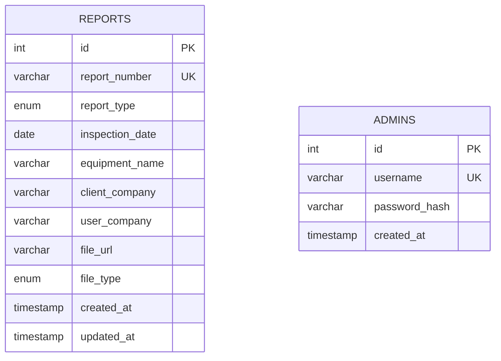

# 数据库设计文档

**项目名称：** 检测报告在线查询系统
**文档版本：** 1.0
**创建日期：** 2025-10-13
**数据库类型：** MySQL 8.0+

---

## 目录

1. [数据库概述](#数据库概述)
2. [表结构设计](#表结构设计)
3. [索引设计](#索引设计)
4. [数据字典](#数据字典)
5. [示例数据](#示例数据)

---

## 数据库概述

### 数据库信息

- **数据库名称：** `checkReport`
- **字符集：** `utf8mb4`
- **排序规则：** `utf8mb4_unicode_ci`
- **存储引擎：** InnoDB

### ER 图



---

## 表结构设计

### 1. reports（报告表）

**表说明：** 存储检测报告的元数据信息

```sql
CREATE TABLE `reports` (
  `id` INT UNSIGNED NOT NULL AUTO_INCREMENT COMMENT '主键ID',
  `report_number` VARCHAR(50) NOT NULL COMMENT '报告编号（唯一）',
  `report_type` ENUM('INSPECTION_CERT', 'INSTALLATION_INSPECTION') NOT NULL COMMENT '报告类型',
  `inspection_date` DATE NOT NULL COMMENT '检测日期',
  `equipment_name` VARCHAR(200) NOT NULL COMMENT '设备名称',
  `client_company` VARCHAR(200) NOT NULL COMMENT '委托单位',
  `user_company` VARCHAR(200) NOT NULL COMMENT '使用单位',
  `file_url` VARCHAR(500) NOT NULL COMMENT '文件路径（相对于uploads目录）',
  `file_type` ENUM('PDF', 'JPG', 'PNG') NOT NULL COMMENT '文件类型',
  `created_at` TIMESTAMP NOT NULL DEFAULT CURRENT_TIMESTAMP COMMENT '创建时间',
  `updated_at` TIMESTAMP NOT NULL DEFAULT CURRENT_TIMESTAMP ON UPDATE CURRENT_TIMESTAMP COMMENT '更新时间',
  PRIMARY KEY (`id`),
  UNIQUE KEY `uk_report_number` (`report_number`),
  KEY `idx_inspection_date` (`inspection_date`),
  KEY `idx_created_at` (`created_at`)
) ENGINE=InnoDB DEFAULT CHARSET=utf8mb4 COLLATE=utf8mb4_unicode_ci COMMENT='检测报告表';
```

**字段说明：**

| 字段名 | 类型 | 长度 | 允许NULL | 默认值 | 说明 |
|--------|------|------|----------|--------|------|
| id | INT UNSIGNED | - | NO | AUTO_INCREMENT | 主键，自增ID |
| report_number | VARCHAR | 50 | NO | - | 报告编号，唯一索引 |
| report_type | ENUM | - | NO | - | 报告类型：INSPECTION_CERT（检测合格证）/ INSTALLATION_INSPECTION（安装委托检验） |
| inspection_date | DATE | - | NO | - | 检测日期 |
| equipment_name | VARCHAR | 200 | NO | - | 设备名称（如：挖掘机、钻孔桩机） |
| client_company | VARCHAR | 200 | NO | - | 委托单位名称 |
| user_company | VARCHAR | 200 | NO | - | 使用单位名称 |
| file_url | VARCHAR | 500 | NO | - | 文件相对路径（如：reports/2025/10/xxx.pdf） |
| file_type | ENUM | - | NO | - | 文件类型：PDF / JPG / PNG |
| created_at | TIMESTAMP | - | NO | CURRENT_TIMESTAMP | 记录创建时间 |
| updated_at | TIMESTAMP | - | NO | CURRENT_TIMESTAMP | 记录更新时间，自动更新 |

**业务规则：**
- `report_number` 必须唯一，用于公众查询
- `file_url` 存储相对路径，实际访问时拼接完整URL
- `inspection_date` 用于报告列表排序和筛选
- `report_type` 和 `file_type` 使用枚举类型，限制可选值

---

### 2. admins（管理员表）

**表说明：** 存储管理员账号信息

```sql
CREATE TABLE `admins` (
  `id` INT UNSIGNED NOT NULL AUTO_INCREMENT COMMENT '主键ID',
  `username` VARCHAR(50) NOT NULL COMMENT '用户名（唯一）',
  `password_hash` VARCHAR(255) NOT NULL COMMENT 'bcrypt加密后的密码',
  `created_at` TIMESTAMP NOT NULL DEFAULT CURRENT_TIMESTAMP COMMENT '创建时间',
  PRIMARY KEY (`id`),
  UNIQUE KEY `uk_username` (`username`)
) ENGINE=InnoDB DEFAULT CHARSET=utf8mb4 COLLATE=utf8mb4_unicode_ci COMMENT='管理员表';
```

**字段说明：**

| 字段名 | 类型 | 长度 | 允许NULL | 默认值 | 说明 |
|--------|------|------|----------|--------|------|
| id | INT UNSIGNED | - | NO | AUTO_INCREMENT | 主键，自增ID |
| username | VARCHAR | 50 | NO | - | 用户名，唯一索引 |
| password_hash | VARCHAR | 255 | NO | - | bcrypt加密的密码（salt rounds=10） |
| created_at | TIMESTAMP | - | NO | CURRENT_TIMESTAMP | 账号创建时间 |

**业务规则：**
- `username` 必须唯一
- `password_hash` 存储使用 bcrypt 加密后的密码，永不明文存储
- MVP阶段暂不实现角色权限系统，所有管理员权限相同

---

## 索引设计

### reports 表索引

| 索引名 | 索引类型 | 字段 | 说明 |
|--------|----------|------|------|
| PRIMARY | 主键 | id | 自增主键 |
| uk_report_number | 唯一索引 | report_number | 用于报告编号查询，保证唯一性 |
| idx_inspection_date | 普通索引 | inspection_date | 用于按日期排序和筛选 |
| idx_created_at | 普通索引 | created_at | 用于后台报告列表按创建时间排序 |

**索引使用场景：**
- `uk_report_number`: 公众查询接口 `GET /api/reports/:reportNumber`
- `idx_inspection_date`: 后台列表按检测日期排序
- `idx_created_at`: 后台列表按创建时间排序（默认）

### admins 表索引

| 索引名 | 索引类型 | 字段 | 说明 |
|--------|----------|------|------|
| PRIMARY | 主键 | id | 自增主键 |
| uk_username | 唯一索引 | username | 用于登录查询，保证唯一性 |

---

## 数据字典

### 枚举类型定义

#### report_type（报告类型）

| 枚举值 | 说明 | 示例 |
|--------|------|------|
| INSPECTION_CERT | 检测合格证报告 | 设备检测合格证 |
| INSTALLATION_INSPECTION | 安装委托检验报告 | 设备安装委托检验报告 |

#### file_type（文件类型）

| 枚举值 | MIME类型 | 说明 |
|--------|----------|------|
| PDF | application/pdf | PDF文档 |
| JPG | image/jpeg | JPEG图片 |
| PNG | image/png | PNG图片 |

---

## 示例数据

### reports 表示例数据

```sql
INSERT INTO `reports` (
  `report_number`,
  `report_type`,
  `inspection_date`,
  `equipment_name`,
  `client_company`,
  `user_company`,
  `file_url`,
  `file_type`
) VALUES
(
  'ZJW20230145',
  'INSPECTION_CERT',
  '2023-04-12',
  '挖掘机 XE60DA',
  '杭州建设工程有限公司',
  '浙江建工集团',
  'reports/2023/04/ZJW20230145.pdf',
  'PDF'
),
(
  'ZJP20230145',
  'INSTALLATION_INSPECTION',
  '2023-04-15',
  '钻孔桩机 ZK-150',
  '宁波港口建设公司',
  '宁波港务集团',
  'reports/2023/04/ZJP20230145.pdf',
  'PDF'
);
```

### admins 表示例数据

```sql
-- 密码明文: Admin@123
-- 使用 bcrypt salt rounds=10 加密后的示例
INSERT INTO `admins` (`username`, `password_hash`) VALUES
('admin', '$2b$10$rOzK9vE.zxQp6qKj0Z9Ys.6WJXvNxkJ3qY4pKzH7NmPZQr8WtLvXu');

-- 实际使用时，密码哈希应该通过 bcrypt.hash() 生成
```

---

## 数据库初始化脚本

### 完整初始化脚本

```sql
-- 创建数据库
CREATE DATABASE IF NOT EXISTS `checkReport`
  DEFAULT CHARACTER SET utf8mb4
  COLLATE utf8mb4_unicode_ci;

USE `checkReport`;

-- 创建 reports 表
CREATE TABLE `reports` (
  `id` INT UNSIGNED NOT NULL AUTO_INCREMENT COMMENT '主键ID',
  `report_number` VARCHAR(50) NOT NULL COMMENT '报告编号（唯一）',
  `report_type` ENUM('INSPECTION_CERT', 'INSTALLATION_INSPECTION') NOT NULL COMMENT '报告类型',
  `inspection_date` DATE NOT NULL COMMENT '检测日期',
  `equipment_name` VARCHAR(200) NOT NULL COMMENT '设备名称',
  `client_company` VARCHAR(200) NOT NULL COMMENT '委托单位',
  `user_company` VARCHAR(200) NOT NULL COMMENT '使用单位',
  `file_url` VARCHAR(500) NOT NULL COMMENT '文件路径（相对于uploads目录）',
  `file_type` ENUM('PDF', 'JPG', 'PNG') NOT NULL COMMENT '文件类型',
  `created_at` TIMESTAMP NOT NULL DEFAULT CURRENT_TIMESTAMP COMMENT '创建时间',
  `updated_at` TIMESTAMP NOT NULL DEFAULT CURRENT_TIMESTAMP ON UPDATE CURRENT_TIMESTAMP COMMENT '更新时间',
  PRIMARY KEY (`id`),
  UNIQUE KEY `uk_report_number` (`report_number`),
  KEY `idx_inspection_date` (`inspection_date`),
  KEY `idx_created_at` (`created_at`)
) ENGINE=InnoDB DEFAULT CHARSET=utf8mb4 COLLATE=utf8mb4_unicode_ci COMMENT='检测报告表';

-- 创建 admins 表
CREATE TABLE `admins` (
  `id` INT UNSIGNED NOT NULL AUTO_INCREMENT COMMENT '主键ID',
  `username` VARCHAR(50) NOT NULL COMMENT '用户名（唯一）',
  `password_hash` VARCHAR(255) NOT NULL COMMENT 'bcrypt加密后的密码',
  `created_at` TIMESTAMP NOT NULL DEFAULT CURRENT_TIMESTAMP COMMENT '创建时间',
  PRIMARY KEY (`id`),
  UNIQUE KEY `uk_username` (`username`)
) ENGINE=InnoDB DEFAULT CHARSET=utf8mb4 COLLATE=utf8mb4_unicode_ci COMMENT='管理员表';

-- 创建默认管理员账号（密码: Admin@123）
INSERT INTO `admins` (`username`, `password_hash`) VALUES
('admin', '$2b$10$rOzK9vE.zxQp6qKj0Z9Ys.6WJXvNxkJ3qY4pKzH7NmPZQr8WtLvXu');
```

---

## Prisma Schema

### 对应的 Prisma Schema 定义

```prisma
// prisma/schema.prisma

generator client {
  provider = "prisma-client-js"
}

datasource db {
  provider = "mysql"
  url      = env("DATABASE_URL")
}

enum ReportType {
  INSPECTION_CERT
  INSTALLATION_INSPECTION
}

enum FileType {
  PDF
  JPG
  PNG
}

model Report {
  id             Int        @id @default(autoincrement()) @db.UnsignedInt
  reportNumber   String     @unique @map("report_number") @db.VarChar(50)
  reportType     ReportType @map("report_type")
  inspectionDate DateTime   @map("inspection_date") @db.Date
  equipmentName  String     @map("equipment_name") @db.VarChar(200)
  clientCompany  String     @map("client_company") @db.VarChar(200)
  userCompany    String     @map("user_company") @db.VarChar(200)
  fileUrl        String     @map("file_url") @db.VarChar(500)
  fileType       FileType   @map("file_type")
  createdAt      DateTime   @default(now()) @map("created_at") @db.Timestamp(0)
  updatedAt      DateTime   @updatedAt @map("updated_at") @db.Timestamp(0)

  @@index([reportNumber], map: "uk_report_number")
  @@index([inspectionDate], map: "idx_inspection_date")
  @@index([createdAt], map: "idx_created_at")
  @@map("reports")
}

model Admin {
  id           Int      @id @default(autoincrement()) @db.UnsignedInt
  username     String   @unique @db.VarChar(50)
  passwordHash String   @map("password_hash") @db.VarChar(255)
  createdAt    DateTime @default(now()) @map("created_at") @db.Timestamp(0)

  @@index([username], map: "uk_username")
  @@map("admins")
}
```

---

## 数据维护建议

### 数据备份策略

1. **每日备份：** 使用 mysqldump 每日凌晨自动备份
2. **备份保留：** 保留最近 30 天的备份
3. **备份脚本示例：**

```bash
#!/bin/bash
# backup-db.sh

DATE=$(date +%Y%m%d_%H%M%S)
BACKUP_DIR="/var/backups/mysql"
DB_NAME="checkReport"

mysqldump -u root -p${MYSQL_PASSWORD} \
  --single-transaction \
  --routines \
  --triggers \
  ${DB_NAME} | gzip > ${BACKUP_DIR}/${DB_NAME}_${DATE}.sql.gz

# 删除30天前的备份
find ${BACKUP_DIR} -name "${DB_NAME}_*.sql.gz" -mtime +30 -delete
```

### 数据清理策略

1. **定期清理旧报告：** 根据业务需求，可定期归档或删除过期报告
2. **文件同步清理：** 删除数据库记录时，同步删除对应的上传文件

---

## 性能优化建议

### 查询优化

1. **报告查询：** 使用 `report_number` 唯一索引，查询性能 O(log n)
2. **列表分页：** 使用 `created_at` 索引，配合 LIMIT OFFSET
3. **避免全表扫描：** 所有查询条件都应使用索引字段

### 存储优化

1. **定期优化表：** `OPTIMIZE TABLE reports;`
2. **监控表大小：** 定期检查表和索引大小
3. **文件路径优化：** 使用相对路径，减少字段长度

---

**文档状态：** 完成
**最后更新：** 2025-10-13
