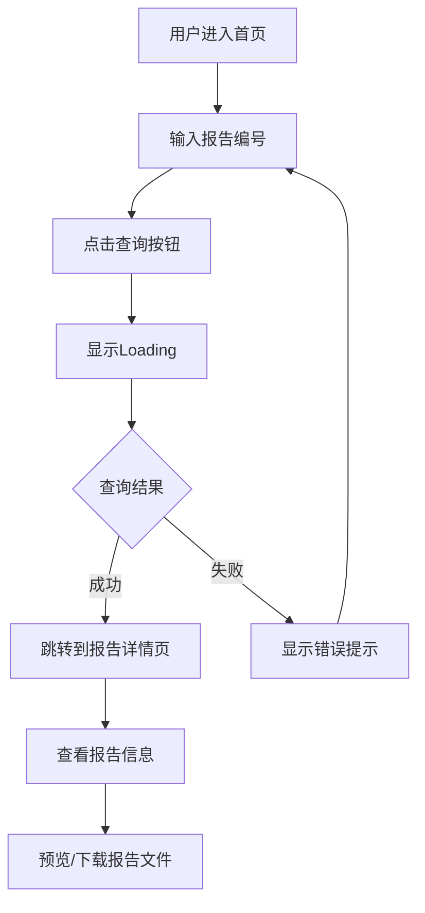
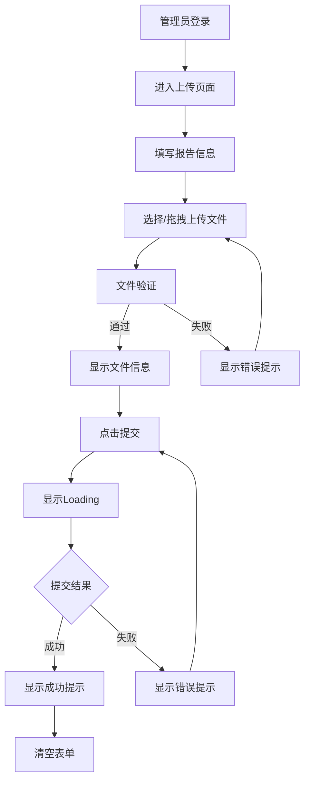
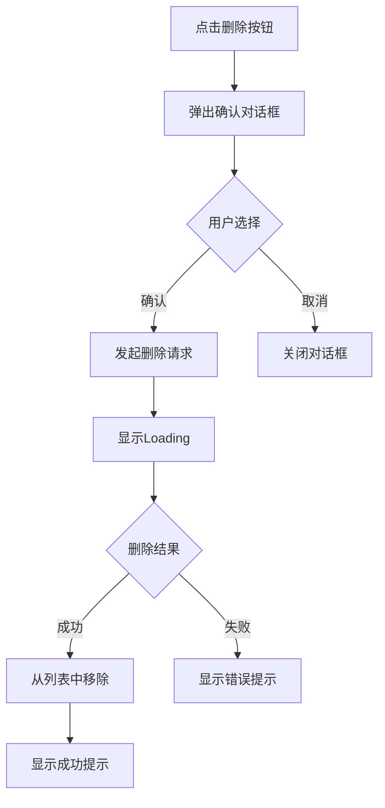

# UI/UX 设计文档

**项目名称：** 检测报告在线查询系统
**文档版本：** 1.0
**创建日期：** 2025-10-13
**设计风格：** 简洁专业，移动端优先

---

## 目录

1. [设计概述](#设计概述)
2. [设计原则](#设计原则)
3. [视觉设计规范](#视觉设计规范)
4. [页面设计](#页面设计)
5. [组件设计](#组件设计)
6. [交互设计](#交互设计)
7. [响应式设计](#响应式设计)

---

## 设计概述

### 设计目标

- **简洁高效：** 减少用户操作步骤，快速完成查询和管理任务
- **专业可信：** 体现检测机构的专业性和可信度
- **移动优先：** 60%+ 用户通过移动端访问，优先保证移动端体验
- **易于维护：** 使用成熟的 UI 组件库，降低维护成本

### 目标用户

**主要用户：** 工地质检人员（移动端为主）
**次要用户：** 公司内部管理员（桌面端为主）

---

## 设计原则

### KISS 原则（Keep It Simple, Stupid）

- 每个页面只聚焦一个核心任务
- 避免不必要的装饰元素
- 使用清晰的文字标签，减少用户思考

### 移动端优先

- 所有页面先设计移动端布局
- 触控目标至少 44x44px
- 文字大小至少 14px
- 避免 hover 交互，使用点击/触摸

### 一致性

- 统一的配色方案
- 统一的组件样式
- 统一的交互模式

---

## 视觉设计规范

### 配色方案

#### 主色调（Primary Color）

```
主蓝色：#1890ff (Ant Design 默认蓝)
用途：按钮、链接、重点信息
```

#### 辅助色

```
成功绿：#52c41a - 成功提示
警告橙：#faad14 - 警告提示
错误红：#f5222d - 错误提示
信息蓝：#1890ff - 信息提示
```

#### 中性色

```
标题黑：#000000 - 主标题
正文灰：#333333 - 正文文字
次要灰：#666666 - 次要信息
边框灰：#d9d9d9 - 边框、分割线
背景灰：#f5f5f5 - 页面背景
白色：#ffffff - 卡片背景
```

### 字体规范

#### 字体家族

```css
font-family: -apple-system, BlinkMacSystemFont, 'Segoe UI', 'PingFang SC',
             'Hiragino Sans GB', 'Microsoft YaHei', 'Helvetica Neue',
             Helvetica, Arial, sans-serif;
```

#### 字体大小

| 用途 | 桌面端 | 移动端 | 行高 |
|------|--------|--------|------|
| 主标题 H1 | 24px | 20px | 1.5 |
| 副标题 H2 | 20px | 18px | 1.5 |
| 标题 H3 | 18px | 16px | 1.5 |
| 正文 | 14px | 14px | 1.6 |
| 辅助文字 | 12px | 12px | 1.5 |

### 间距规范

基于 8px 栅格系统：

```
xs: 4px
sm: 8px
md: 16px
lg: 24px
xl: 32px
xxl: 48px
```

### 圆角规范

```
小圆角: 4px - 按钮、输入框
中圆角: 8px - 卡片
大圆角: 12px - 模态框
```

### 阴影规范

```css
/* 卡片阴影 */
box-shadow: 0 2px 8px rgba(0, 0, 0, 0.1);

/* 悬浮阴影 */
box-shadow: 0 4px 12px rgba(0, 0, 0, 0.15);

/* 模态框阴影 */
box-shadow: 0 8px 24px rgba(0, 0, 0, 0.2);
```

---

## 页面设计

### 1. 公众官网首页

#### 页面布局（移动端）

```
┌─────────────────────────┐
│      页头 Header        │ 60px
│  Logo + 公司名称        │
├─────────────────────────┤
│                         │
│    公司简介区域         │ 自适应
│  简介文字 + 资质图片    │
│                         │
├─────────────────────────┤
│                         │
│   报告查询区域（核心）  │ 突出显示
│  ┌──────────────────┐   │
│  │  输入报告编号    │   │
│  └──────────────────┘   │
│      [查询按钮]         │
│                         │
├─────────────────────────┤
│    服务范围介绍         │ 可选
│                         │
├─────────────────────────┤
│    联系方式区域         │
│  电话 | 邮箱 | 地址     │
├─────────────────────────┤
│      页脚 Footer        │ 40px
│  版权信息 | 备案号      │
└─────────────────────────┘
```

#### 关键元素

**查询输入框：**
- 高度：48px（移动端）
- 占位符：「请输入报告编号」
- 前缀图标：搜索图标
- 自动 focus（移动端可选）

**查询按钮：**
- 高度：48px
- 宽度：100px 或全宽（移动端）
- 文字：「查询」
- 图标：搜索图标

### 2. 报告详情页

#### 页面布局（移动端）

```
┌─────────────────────────┐
│      页头 Header        │ 60px
│  < 返回首页  |  Logo   │
├─────────────────────────┤
│                         │
│    报告信息卡片         │
│  ┌──────────────────┐   │
│  │ 报告编号：XXX    │   │
│  │ 报告类型：XXX    │   │
│  │ 检测日期：XXX    │   │
│  │ 设备名称：XXX    │   │
│  │ 委托单位：XXX    │   │
│  │ 使用单位：XXX    │   │
│  └──────────────────┘   │
│                         │
├─────────────────────────┤
│                         │
│   报告文件预览区域      │ 可滚动
│  ┌──────────────────┐   │
│  │                  │   │
│  │   PDF/图片预览   │   │
│  │                  │   │
│  └──────────────────┘   │
│                         │
├─────────────────────────┤
│   [下载报告] 按钮       │ 固定底部
└─────────────────────────┘
```

#### 关键元素

**信息卡片：**
- 白色背景，圆角 8px
- 字段名：12px，灰色
- 字段值：14px，黑色
- 行间距：16px

**文件预览区域：**
- PDF：使用 `<iframe>` 或 react-pdf
- 图片：直接显示 ``
- 移动端：可左右滑动查看多页

**下载按钮：**
- 固定在底部
- 高度：48px
- 全宽按钮
- 主题色背景

### 3. 管理员登录页

#### 页面布局

```
┌─────────────────────────┐
│                         │
│         居中布局         │ 全屏
│                         │
│  ┌──────────────────┐   │
│  │                  │   │
│  │   🔐 Logo       │   │
│  │  系统管理后台    │   │
│  │                  │   │
│  │ ┌──────────────┐ │   │
│  │ │ 用户名       │ │   │
│  │ └──────────────┘ │   │
│  │                  │   │
│  │ ┌──────────────┐ │   │
│  │ │ 密码         │ │   │
│  │ └──────────────┘ │   │
│  │                  │   │
│  │   [登录按钮]     │   │
│  │                  │   │
│  └──────────────────┘   │
│                         │
└─────────────────────────┘
```

#### 关键元素

**登录卡片：**
- 宽度：400px（桌面端）/ 90%（移动端）
- 白色背景，阴影
- 圆角：12px
- 内边距：32px

**输入框：**
- 高度：40px
- 圆角：4px
- 边框：1px solid #d9d9d9
- Focus 时：蓝色边框

**登录按钮：**
- 高度：40px
- 全宽
- 主题色背景

### 4. 管理后台 - 报告列表页

#### 页面布局（桌面端）

```
┌───────────────────────────────────────┐
│  侧边栏         │      主内容区        │
│  (200px)        │                     │
│ ┌────────┐      │  ┌───────────────┐ │
│ │ 报告列表 │ ✓   │  │  页头标题     │ │
│ │ 上传报告 │     │  │  操作按钮区   │ │
│ │ 退出     │     │  └───────────────┘ │
│ └────────┘      │                     │
│                 │  ┌───────────────┐ │
│                 │  │   搜索筛选    │ │
│                 │  └───────────────┘ │
│                 │                     │
│                 │  ┌───────────────┐ │
│                 │  │               │ │
│                 │  │   报告表格    │ │
│                 │  │               │ │
│                 │  └───────────────┘ │
│                 │                     │
│                 │  ┌───────────────┐ │
│                 │  │   分页组件    │ │
│                 │  └───────────────┘ │
└───────────────────────────────────────┘
```

#### 关键元素

**表格列：**
- 报告编号（可点击查看）
- 报告类型
- 检测日期
- 设备名称
- 创建时间
- 操作（编辑、删除）

**操作按钮：**
- 编辑：主题色，图标 + 文字
- 删除：红色，图标 + 文字
- 弹出确认对话框

**搜索框：**
- 宽度：300px
- 占位符：「搜索报告编号」
- 实时搜索或按钮搜索

### 5. 管理后台 - 报告上传页

#### 页面布局

```
┌───────────────────────────────────────┐
│  侧边栏         │      主内容区        │
│                 │                     │
│                 │  ┌───────────────┐ │
│                 │  │  上传报告表单  │ │
│                 │  │               │ │
│                 │  │ 报告编号 *    │ │
│                 │  │ ┌───────────┐ │ │
│                 │  │ │           │ │ │
│                 │  │ └───────────┘ │ │
│                 │  │               │ │
│                 │  │ 报告类型 *    │ │
│                 │  │ ○ 检测合格证  │ │
│                 │  │ ○ 安装委托    │ │
│                 │  │               │ │
│                 │  │ 检测日期 *    │ │
│                 │  │ [日期选择器]  │ │
│                 │  │               │ │
│                 │  │ 设备名称 *    │ │
│                 │  │ ...           │ │
│                 │  │               │ │
│                 │  │ 上传文件 *    │ │
│                 │  │ ┌───────────┐ │ │
│                 │  │ │点击或拖拽  │ │ │
│                 │  │ │上传文件    │ │ │
│                 │  │ └───────────┘ │ │
│                 │  │               │ │
│                 │  │ [提交] [取消] │ │
│                 │  └───────────────┘ │
└───────────────────────────────────────┘
```

#### 关键元素

**表单字段：**
- 报告编号：文本输入
- 报告类型：单选按钮
- 检测日期：日期选择器
- 设备名称：文本输入
- 委托单位：文本输入
- 使用单位：文本输入
- 上传文件：拖拽上传组件

**文件上传组件：**
- 拖拽区域：虚线边框，灰色背景
- 支持点击选择文件
- 显示文件名、大小、类型
- 支持删除重新上传
- 限制：PDF、JPG、PNG，最大 10MB

**提交按钮：**
- 主题色
- 文字：「提交上传」
- Loading 状态

---

## 组件设计

### 1. Header（页头组件）

#### 公众官网 Header

```jsx
<Header>
  <Logo src="logo.png" />
  <CompanyName>浙江省牛叉检测技术有限公司</CompanyName>
</Header>
```

**样式：**
- 高度：60px
- 背景：白色
- 底部边框：1px solid #e8e8e8
- 居中对齐

#### 管理后台 Header

```jsx
<Header>
  <Title>报告管理系统</Title>
  <UserInfo>
    <Avatar />
    <Username>admin</Username>
    <LogoutButton />
  </UserInfo>
</Header>
```

### 2. SearchBox（查询输入框组件）

```jsx
<SearchBox>
  <Input
    prefix={<SearchIcon />}
    placeholder="请输入报告编号"
    size="large"
  />
  <Button type="primary" size="large">
    查询
  </Button>
</SearchBox>
```

**状态：**
- 默认状态
- Focus 状态（蓝色边框）
- Loading 状态（查询中）
- Error 状态（查询失败）

### 3. ReportCard（报告信息卡片）

```jsx
<ReportCard>
  <InfoRow>
    <Label>报告编号：</Label>
    <Value>ZJW20230145</Value>
  </InfoRow>
  <InfoRow>
    <Label>报告类型：</Label>
    <Value>检测合格证</Value>
  </InfoRow>
  {/* ... 更多字段 */}
</ReportCard>
```

**样式：**
- 白色背景
- 圆角：8px
- 内边距：16px
- 阴影：轻微

### 4. FileUpload（文件上传组件）

```jsx
<FileUpload
  accept=".pdf,.jpg,.jpeg,.png"
  maxSize={10 * 1024 * 1024}
  onUpload={handleUpload}
>
  <UploadArea>
    <Icon type="inbox" />
    <Text>点击或拖拽文件到此区域上传</Text>
    <Hint>支持 PDF、JPG、PNG，最大 10MB</Hint>
  </UploadArea>
</FileUpload>
```

**状态：**
- 默认状态（虚线边框）
- Hover 状态（蓝色边框）
- Drag over 状态（蓝色背景）
- Uploading 状态（进度条）
- Success 状态（显示文件信息）
- Error 状态（红色提示）

### 5. Table（报告列表表格）

```jsx
<Table
  columns={[
    { title: '报告编号', dataIndex: 'reportNumber', key: 'reportNumber' },
    { title: '报告类型', dataIndex: 'reportType', key: 'reportType' },
    { title: '检测日期', dataIndex: 'inspectionDate', key: 'inspectionDate' },
    { title: '设备名称', dataIndex: 'equipmentName', key: 'equipmentName' },
    { title: '创建时间', dataIndex: 'createdAt', key: 'createdAt' },
    { title: '操作', key: 'actions', render: (_, record) => (
      <>
        <Button type="link" onClick={() => handleEdit(record)}>编辑</Button>
        <Button type="link" danger onClick={() => handleDelete(record)}>删除</Button>
      </>
    )}
  ]}
  dataSource={reports}
  pagination={{
    current: page,
    pageSize: 20,
    total: total,
    onChange: handlePageChange
  }}
/>
```

---

## 交互设计

### 查询报告流程



**交互细节：**
1. 输入框支持回车触发查询
2. 查询中按钮显示 Loading 状态并禁用
3. 查询成功直接跳转，无过渡动画
4. 查询失败弹出 Toast 提示，3秒后自动消失
5. 错误提示内容：「未找到该报告，请确认报告编号是否正确」

### 上传报告流程



**交互细节：**
1. 文件上传组件支持拖拽和点击两种方式
2. 文件选择后立即验证类型和大小
3. 提交前验证所有必填字段
4. 提交中禁用表单和按钮
5. 成功后显示 Toast 提示：「报告上传成功」
6. 失败后显示具体错误信息（如：「报告编号已存在」）

### 删除报告流程



**交互细节：**
1. 删除按钮使用危险色（红色）
2. 确认对话框标题：「确认删除」
3. 对话框内容：「确定要删除该报告吗？删除后无法恢复。」
4. 对话框按钮：「取消」（默认）和「删除」（危险）
5. 删除成功后刷新列表

---

## 响应式设计

### 断点定义

```css
/* 移动端 */
@media (max-width: 767px) {
  /* 手机竖屏 */
}

/* 平板端 */
@media (min-width: 768px) and (max-width: 1023px) {
  /* 平板 */
}

/* 桌面端 */
@media (min-width: 1024px) {
  /* 桌面 */
}
```

### 布局适配

#### 公众官网首页

| 元素 | 移动端 | 桌面端 |
|------|--------|--------|
| 容器宽度 | 100% | 1200px |
| 查询框宽度 | 100% | 500px |
| 查询按钮 | 全宽 | 固定宽度 |
| 公司简介 | 单列 | 双列 |

#### 管理后台

| 元素 | 移动端 | 桌面端 |
|------|--------|--------|
| 侧边栏 | 抽屉（隐藏） | 固定显示 |
| 表格 | 卡片列表 | 表格 |
| 表单 | 单列 | 双列 |

---

## 无障碍设计

### 基本要求

1. **语义化 HTML：** 使用正确的 HTML 标签
2. **键盘导航：** 所有交互元素支持键盘访问
3. **ARIA 标签：** 为屏幕阅读器添加描述
4. **颜色对比：** 文字和背景对比度 ≥ 4.5:1
5. **Focus 状态：** 明显的焦点指示器

### 实现示例

```jsx
<Button
  type="primary"
  aria-label="查询报告"
  tabIndex={0}
>
  查询
</Button>

<Input
  placeholder="请输入报告编号"
  aria-label="报告编号输入框"
  aria-required="true"
/>
```

---

## 设计资源

### Ant Design 组件使用

本项目使用 Ant Design 5.x 作为 UI 组件库：

**常用组件：**
- Button - 按钮
- Input - 输入框
- Form - 表单
- Table - 表格
- Modal - 模态框
- Message - 消息提示
- Upload - 文件上传
- DatePicker - 日期选择器
- Card - 卡片
- Layout - 布局

### 图标库

使用 Ant Design Icons：
- SearchOutlined - 搜索图标
- UploadOutlined - 上传图标
- DeleteOutlined - 删除图标
- EditOutlined - 编辑图标
- DownloadOutlined - 下载图标
- UserOutlined - 用户图标

---

## 设计检查清单

### 上线前检查

- [ ] 所有页面在移动端和桌面端显示正常
- [ ] Loading 状态有明确提示
- [ ] 错误提示文案清晰友好
- [ ] 所有按钮有合适的尺寸和点击区域
- [ ] 表单验证提示位置合理
- [ ] 颜色对比度符合可访问性标准
- [ ] 支持键盘导航
- [ ] 所有图片有 alt 属性
- [ ] 字体大小在移动端清晰可读
- [ ] 页面加载时间 < 2 秒

---

**文档状态：** 完成
**最后更新：** 2025-10-13
